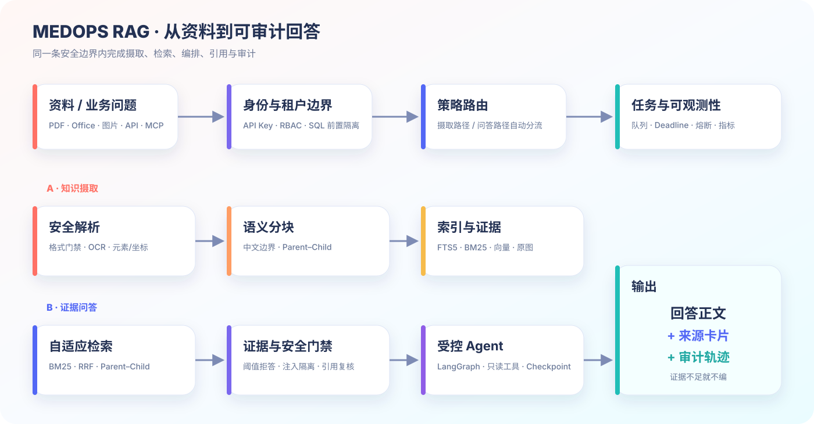
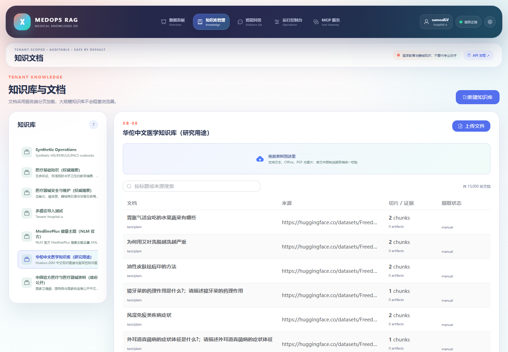
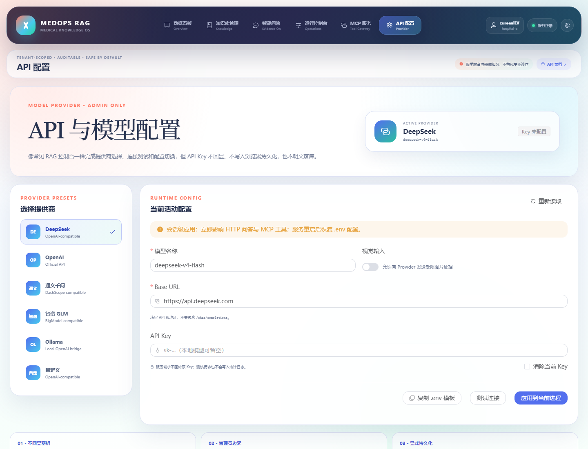
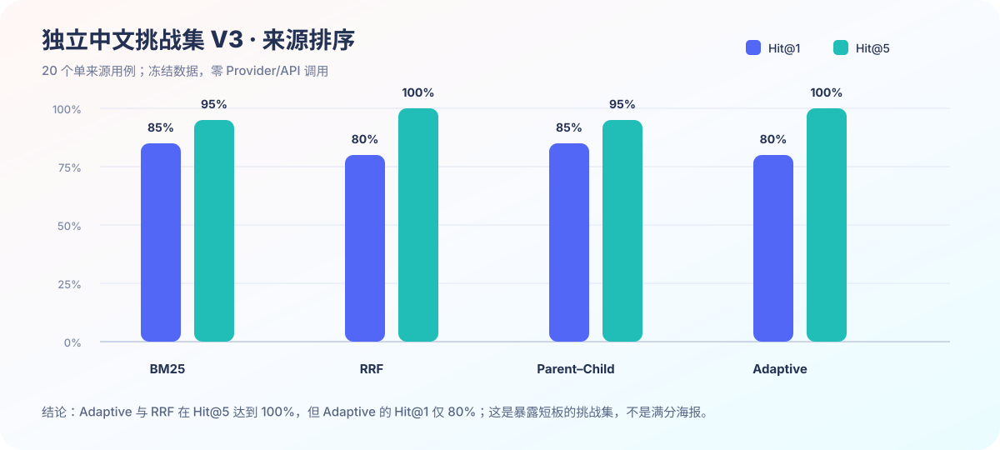
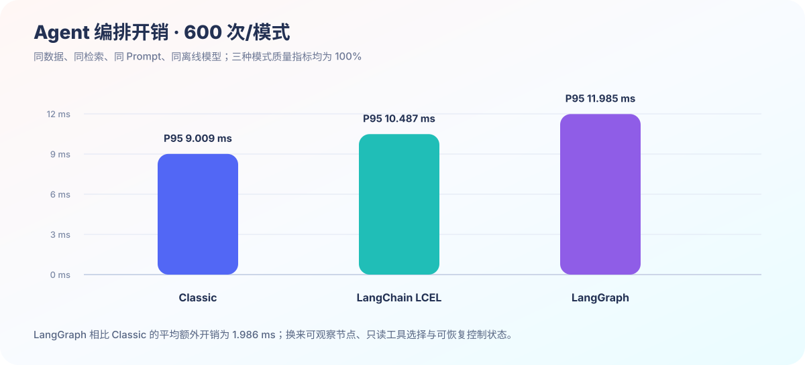
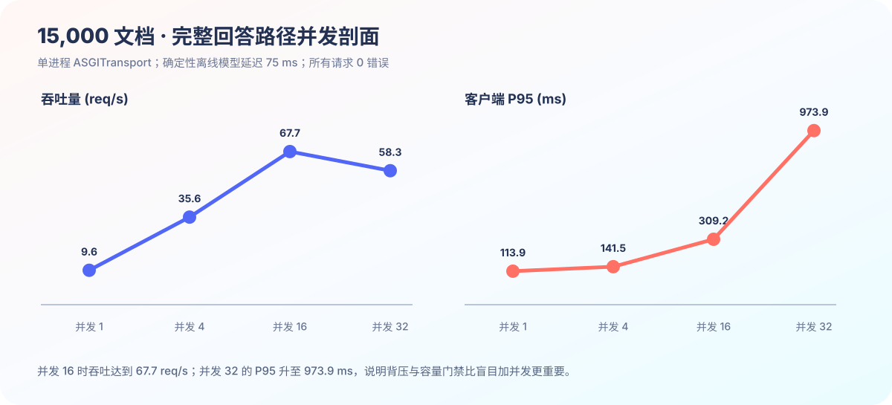

# MedOps RAG V3.4｜可审计的医疗知识 Agent 系统

[English](README_EN.md) · [学习导览](docs/LEARNING_GUIDE.md) · [部署说明](docs/v2/DEPLOYMENT.md) · [安全威胁模型](THREAT_MODEL.md)

面向**公开医疗知识与医疗器械证据**的多租户 RAG：把文档解析、混合检索、受控 Agent、MCP、引用复核与运行审计收进一条可解释链路。

> **边界声明：**这是教学与工程作品集，不是医疗器械；不诊断、不处方、不处理真实患者资料，也不会执行改变系统状态的工具。



## 先看懂这条流程

1. **资料与问题先过边界**：API Key / RBAC 解析租户和角色，SQL 在检索前完成租户过滤，而不是把别人的内容交给模型后再过滤。
2. **摄取与问答分两条路径**：文档进入安全解析、OCR、语义分块和索引；问题进入 BM25 / RRF / Parent–Child 自适应检索。
3. **Agent 不能自由乱跑**：LangGraph 最多调用两个代码所有、只读的白名单工具，并记录有界控制状态。
4. **输出必须能追溯**：答案附带 `[来源N]` 与来源卡片；证据不足、疑似提示注入或涉及医疗建议时明确拒答。
5. **整条链路可观察**：请求 ID、`Server-Timing`、队列、模型、路由、熔断、截止时间和重试预算都可查询。

## 界面预览

### 总览：把系统状态与安全链路放在第一屏


<table>
<tr>
<td width="50%">
<strong>知识库与文档</strong><br><br>

<br>租户知识空间、服务端分页、来源搜索与受控上传，不把整库正文一次塞进浏览器。
</td>
<td width="50%">
<strong>MCP 服务</strong><br><br>

<br>展示 Streamable HTTP 端点、身份头、客户端配置，并可真实执行初始化与工具发现。
</td>
</tr>
</table>

### API 配置：可见、可测，但不把密钥摊在浏览器里



控制台还包含**带来源问答、运行指标、Provider 状态、检索实验室与 Agent 轨迹**。普通 viewer/editor 只提交业务问题；仅管理员能测试或切换 Provider、调整实验参数。API Key 不回显、不写入浏览器持久化、不明文落库；界面应用的是当前进程配置，重启后恢复本机 `.env`，避免用“方便”给密钥裸奔找借口。

## 项目要解决什么

| 真实问题 | MedOps 的处理方式 | 可核验结果 |
|---|---|---|
| 医疗资料格式杂乱、来源难追 | 统一解析 PDF / Office / 图片 / CSV / JSON，并保留页码、标题、坐标、URL 和哈希 | 文本与图片证据都能回到原文档 |
| 多租户 RAG 容易越权 | 服务端身份解析、RBAC、SQL 前置租户过滤、引用范围二次复核 | 其他租户 KB 不可见，内容不进入模型上下文 |
| 检索分数高不代表真有答案 | 绝对证据阈值、负例校准、提示注入隔离和策略拒答 | 无证据时明确 abstain，不拿“最不差结果”硬答 |
| Agent 容易不可控 | LangGraph 有界节点、只读白名单工具、Checkpoint 不保存敏感正文 | 能看见路径，也能限制工具与状态体积 |
| Demo 跑得动却无法运维 | 持久任务、租约、幂等键、超时、背压、熔断、审计与指标 | 失败可恢复，过载显式返回，行为可复现 |
| 外部 AI 难以复用知识能力 | 官方 MCP Python SDK 2.2 + Streamable HTTP | Codex 等客户端可在相同租户边界内调用证据工具 |

## 核心能力

### 1. 文档摄取与多模态证据

- 支持 TXT、Markdown、PDF、DOCX、PPTX、PNG、JPEG、WebP、CSV、JSON、JSONL；
- Office 压缩包在解压前检查条目数、膨胀量、压缩比、危险路径与宏；PDF 限制页数和渲染预算；
- RapidOCR/ONNX Runtime 处理扫描 PDF 与内嵌图片，保留页面/幻灯片/形状坐标；
- 图片按租户进行 SHA-256 BLOB 去重，可返回原图与哈希 ETag；
- 异步摄取任务支持幂等、租约、有限重试、取消和崩溃恢复。

### 2. 检索、路由与可靠回答

- SQLite FTS5 trigram 候选召回，叠加 BM25、RRF、可选 FastEmbed 向量与 Parent–Child 上下文恢复；
- 自适应路由根据问题特征选择 BM25 / RRF / Parent–Child，并输出原因、置信度和候选分数；
- 支持 Rewrite、Multi-query、模板 HyDE 实验，但默认策略只启用经过门禁的路径；
- 回答正文不泄露内部 chunk ID 或分数，只显示人能读懂的编号来源卡片；
- 可选 CLIP 图文检索能召回无文字图片，但中文跨模态质量未过门禁，因此默认关闭。

### 3. 受控 Agent、Provider 与 MCP

- 同一 `/answer` 接口支持 Classic Python、LangChain LCEL 与 LangGraph 三种编排；
- LangGraph 路径最多选择两个只读工具：证据回答与引用租户复核；非法工具、非法参数直接拒绝；
- Provider 使用 lifespan 共享 `httpx.AsyncClient`、租户轮转、全局/租户容量、总 deadline、有限重试、指数抖动、`Retry-After` 上限和熔断器；
- 管理员 API 配置页提供 DeepSeek、OpenAI、通义千问、智谱、Ollama 和自定义 OpenAI-compatible 预设，可测试连接、热切换当前进程并复制 `.env` 模板；
- 默认离线抽取式回答；可接入 DeepSeek V4 Flash 或其他 OpenAI-compatible `/chat/completions`；
- `/mcp/` 暴露租户隔离的知识库列表、证据检索和受控回答，API Key 模式复用同一身份与审计逻辑。

## 技术栈

| 层 | 主要技术 | 用途 |
|---|---|---|
| Web 控制台 | Vue 3.5、TypeScript 5.9、Vite 7、Vue Router 4、Pinia 3、Element Plus 2 | 知识库、问答、任务、指标与 MCP 配置 |
| API | Python 3.11+、FastAPI、Pydantic、httpx | 类型化路由、依赖注入、异步 Provider 与 OpenAPI |
| Agent | LangChain 1.4、LangGraph 1.2 | 受控工具编排、节点轨迹与 Checkpoint |
| MCP | MCP Python SDK 2.2、Streamable HTTP | 向外部 AI 客户端提供证据工具 |
| 检索 | SQLite FTS5、rank-bm25、RRF、FastEmbed、可选 Qdrant | 词法/稠密/融合检索与租户过滤 |
| 文档 | PyMuPDF、python-docx、python-pptx、RapidOCR、ONNX Runtime | 文本、表格、OCR、图片与版面元素提取 |
| 存储与任务 | SQLite WAL、事务、租约队列、SHA-256 | 元数据、审计、任务、Checkpoint 与证据去重 |
| 工程质量 | Pytest、Ruff、vue-tsc、Docker Compose | 214 项测试、静态检查、前端构建与多服务部署 |

## 数据与证据资产

| 语料 | 规模与语言 | 来源与用途 | 再分发边界 |
|---|---|---|---|
| 中国官方医疗/医疗器械资料 | 6 份中文政府 PDF | 国家卫健委、药监等官方公开资料；用于可审计中文问答 | 下载时校验主机、重定向、大小、PDF 签名与 SHA-256；原二进制不进 Git |
| Huatuo-26M 研究子集 | 15,000 条中文 QA | 12,000 条知识图谱问答 + 3,000 条医学百科问答 | 固定版本、生成本地来源清单；仅研究用途 |
| NLM MedlinePlus | 英文健康主题 XML，可选西语 | 官方公共健康主题、URL、主题 ID、MeSH 与来源 | 通过官方批量数据复现导入并保留出处 |
| 教学样例 | 两个幂等知识库 | FDA、CDC、WHO、MedlinePlus 公开资料的教育性改写 | 只用于本地演示，不冒充临床知识库 |

详见[中国官方语料说明](docs/v2/OFFICIAL_CHINESE_CORPUS.md)与[公共医疗语料说明](docs/v2/PUBLIC_MEDICAL_CORPORA.md)。

## 测试与基准数据

### 发布门禁

| 门禁 | 当前证据 |
|---|---|
| 自动化测试 | **214 项** API、安全、解析器、迁移、队列、UI、MCP、Provider 配置与异步竞态测试 |
| 回答评测 | 冻结 30-case 的召回、引用正确性与拒答检查 |
| 前端 | `vue-tsc` 类型检查 + Vite 生产构建 |
| 可复现性 | 报告 JSON、数据哈希、版本与运行环境一并提交；`reproduce_release.ps1` 统一入口 |

### 检索策略：难集不是拿来刷满分的



冻结挑战集包含 28 篇文档与 36 个中文用例，刻意加入错字、低词面重叠和三来源冲突。Adaptive 在 20 个单来源题上为 **Hit@1 0.80 / Hit@5 1.00**；在 8 个三来源题上 Recall@5 为 **0.8333**、完整覆盖@5 为 **0.6250**，低于固定 BM25 的 **0.8750 / 0.7500**。这是一条仍需优化的真实短板，不是被藏起来的失败样本。

原始数据：[challenge v3 JSON](reports/adaptive-routing-challenge-zh-v3.json) · [评测说明](docs/v3/ADAPTIVE_CHALLENGE_V3_EVALUATION.md)

### Agent 编排：量化控制能力的代价



离线冻结集每种模式运行 600 次，三者 Hit@5、引用正确率与正确拒答率均为 `1.0000`。LangGraph 相比 Classic 平均增加 **1.986 ms**；真实 `deepseek-v4-flash` 测试还覆盖 8 个官方语料用例、3 次重复和每种模式 24 次运行，用来证明兼容性与 Token/成本遥测，不包装成宽泛的框架速度排名。

原始数据：[离线编排 JSON](reports/agent-orchestration-benchmark-v3.json) · [真实 Provider JSON](reports/deepseek-live-benchmark-v3.json) · [完整报告](docs/v3/BENCHMARK_AGENT_ORCHESTRATION.md)

### 并发：吞吐上升不等于可以无限加压



单进程、15,000 文档、2,304 次离线请求没有错误。完整回答路径在并发 16 达到 **67.655 req/s**，但 P95 已增至 **309.240 ms**；并发 32 吞吐回落、P95 恶化至 **973.943 ms**。因此 V3.4 把背压、容量预算、总 deadline 和熔断当作正式能力，而不是只摆一张峰值吞吐截图。

原始数据：[并发 JSON](reports/concurrency-benchmark-v3.json) · [并发与容量说明](docs/v3/CONCURRENCY_OPTIONS.md)

### 其他关键结果

- 120 正例 / 20 负例冻结集：BM25 与 RRF 接收 `120/120` 个可回答问题，并拒绝 `20/20` 个负例；换领域必须重新校准阈值。
- Parent–Child：50 个问题中，关联操作进入返回上下文的比例由固定分块 `0/50` 提升为 `50/50`，平均检索耗时由 `13.628 ms` 增至 `19.702 ms`。
- CLIP-B/32：20 张无文字图标的英文 Hit@1 为 `0.95`，但中文 Hit@1 只有 `0.10`；因此视觉向量仍是显式实验功能。
- Qdrant Server 1.19.0：10k 向量、并发 8 时 `77.959 query/s`、Recall@10 `1.0`、跨租户命中 `0`；默认发布配置仍选择更简单的 SQLite 精确检索。

## 安全边界与明确限制

- 只使用公开、可审计语料；官方来源和研究语料不等于经过临床专家签核。
- 医疗建议、诊断、处方类请求由策略层拒绝；项目不处理真实患者数据。
- Prompt Injection 检测属于纵深防御，不能宣称完全阻断所有攻击。
- `trusted_headers` 仅适合本地演示；公网部署应使用 API Key 模式并在网关补齐 TLS、限流和密钥管理。
- CLIP 可检索图片，但不能可靠推理图表数值或示意图关系；中文跨模态配置默认关闭。
- SQLite 与进程内检索面向单机作品集/教学部署，不宣称医院级容量或高可用。
- V3.4 前端与异步 Provider 变更后的 Docker Linux 镜像仍需在可用 Docker Engine 主机上重新验证。

## 代码与文档导航

```text
app/api/             FastAPI 路由与鉴权入口
app/services/        回答、检索、摄取与任务编排
app/retrieval/       BM25 / RRF / Adaptive / Parent–Child
app/agents/          Classic / LangChain / LangGraph / Provider
app/mcp/             MCP Server 与租户工具边界
app/parsers/         文档、OCR 与安全解析
frontend/            Vue 3 企业控制台
scripts/             启动、导入、Worker、迁移与复现脚本
evals/               冻结数据与基准 Runner
reports/             原始 JSON 测试证据
docs/                架构、部署、安全与评测说明
```

推荐先读[项目导学](docs/LEARNING_GUIDE.md)，再沿这条调用链打断点：

```text
POST /answer
→ app/api/answers.py
→ app/services/answers.py
→ app/services/retrieval.py
→ app/repositories/documents.py
→ app/retrieval/hybrid.py
→ app/agents/model.py
```

## 安装与启动

### 环境要求

- Python **3.11+**
- Node.js **20.19+ / 22.12+ / 24**（当前验证：Node 24.15.0、npm 11.14.1）
- Windows PowerShell；或安装了 Docker Linux Engine 的 Docker Desktop

### Windows 快速启动

```powershell
git clone https://github.com/zureealLV/medops-rag.git
cd medops-rag
python -m venv .venv
.\.venv\Scripts\python.exe -m pip install -e ".[dev]"
.\scripts\build_frontend.ps1
.\.venv\Scripts\python.exe .\scripts\seed_sample_data.py --profile medical
.\.venv\Scripts\fastapi.exe dev
```

启动后访问：

- Web 控制台：`http://127.0.0.1:8000/`
- Swagger：`http://127.0.0.1:8000/docs`
- MCP Streamable HTTP：`http://127.0.0.1:8000/mcp/`
- 健康检查：`http://127.0.0.1:8000/health`

本地演示默认身份头：

```text
X-Tenant-ID: hospital-a
X-Actor-ID: local-demo
```

### 导入真实公开语料

```powershell
.\.venv\Scripts\python.exe -m scripts.import_chinese_official
.\.venv\Scripts\python.exe -m scripts.import_huatuo
.\.venv\Scripts\python.exe -m scripts.import_medlineplus
```

### 接入外部模型

默认使用离线抽取式回答。若使用 OpenAI-compatible Provider，请复制 `.env.example` 为 `.env`，设置 `MODEL_API_KEY`、`MODEL_BASE_URL` 与 `MODEL_NAME`，不要提交 `.env`。已有外部 DeepSeek dotenv 文件时可直接复用：

```powershell
.\scripts\run_dev.ps1 -EnvFile <外部-.env-路径>
```

启用服务端 API Key 身份模式：

```powershell
.\.venv\Scripts\python.exe .\scripts\manage_api_keys.py create `
  --tenant hospital-a --name local-admin --role admin
$env:AUTH_MODE = "api_key"
```

### Worker 与 Docker Compose

```powershell
# 单次处理摄取/摘要任务
.\.venv\Scripts\python.exe .\scripts\ingestion_worker.py --once
.\.venv\Scripts\python.exe .\scripts\summary_worker.py --once

# API + 摄取 Worker + 摘要 Worker
docker compose up --build
```

### 复现发布门禁

```powershell
.\scripts\reproduce_release.ps1
.\scripts\reproduce_release.ps1 -Full
```
