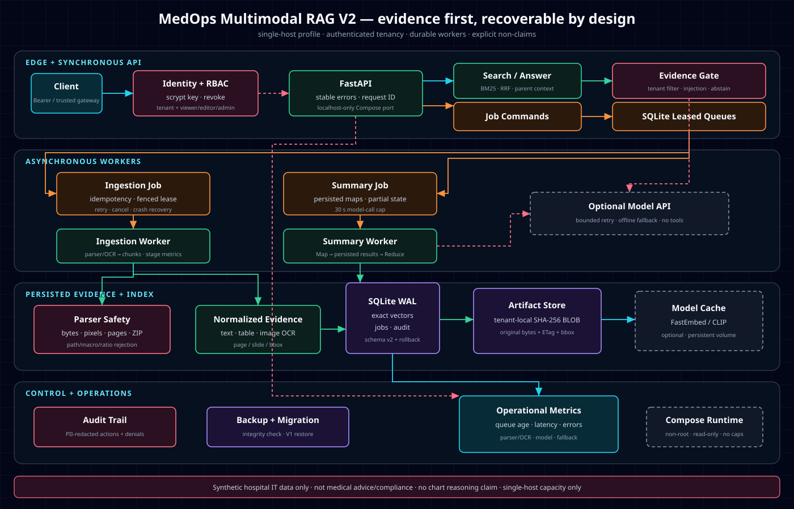

# MedOps Multimodal RAG V2 Alpha.2

[中文说明](README_CN.md) · [V2 engineering design](docs/v2/ENGINEERING_DESIGN.md) · [Alpha.2 visual benchmark](docs/v2/BENCHMARK_REPORT_ALPHA2.md) · [Beta.1 parent-child benchmark](docs/v2/BENCHMARK_REPORT_BETA1.md) · [Roadmap](docs/v2/ROADMAP.md) · [Threat model](THREAT_MODEL.md)

An auditable, tenant-scoped multimodal RAG assistant for **synthetic hospital IT operations documents**. Alpha.2 adds content-addressed image artifacts, optional paired CLIP embeddings, text-to-image retrieval, and retrievable visual citations to the multiformat/OCR pipeline.

> Educational portfolio software, not a medical device. It does not diagnose, prescribe, process real patient records, or execute system-changing tools.

> **Claim boundary:** alpha.2 routes visual questions, retrieves text-free images, and returns stored image evidence. It does not yet claim chart/diagram reasoning or production Chinese cross-modal quality.

## Alpha.2 capabilities

- FastAPI application factory, typed routes, dependency injection, stable errors and OpenAPI;
- SQLite transactions, foreign keys, indexes and restart persistence;
- knowledge-base and document CRUD with SHA-256 idempotent uploads;
- TXT/Markdown/PDF/DOCX/PPTX/PNG/JPEG/WebP parsing with native text, table, and OCR elements;
- page/slide/heading provenance through `GET /documents/{id}/elements`;
- conditional scanned-PDF OCR and embedded-image OCR through RapidOCR/ONNX Runtime;
- tenant-local SHA-256 image BLOB deduplication with page/slide/shape placement metadata;
- `GET /documents/{id}/artifacts`, tenant-scoped original bytes, and hash ETags;
- optional paired CLIP image/text embeddings and `ocr`/`image`/`fusion` visual search;
- automatic `text`/`visual` answer routing, calibrated visual abstention, and retrievable image citations;
- deterministic hashing, keyword, BM25, weighted, and RRF retrieval strategies;
- opt-in structure-aware `parent_child` retrieval that matches small children and reconstructs parent context;
- cited extractive answers and evidence-threshold abstention;
- optional OpenAI-compatible generation with timeout, bounded retry and offline fallback;
- tenant filtering in SQL before retrieval/model context;
- indirect prompt-injection quarantine, PII-safe audit data and medical-advice denial;
- three read-only tools: `search_documents`, `get_document_metadata`, `get_system_status`;
- request IDs, `Server-Timing`, request metrics, 50 API/security/parser/migration tests and repeatable ingestion/retrieval benchmarks;
- reproducible local startup and a Docker Compose definition (Docker runtime was unavailable for this milestone's verification).

## Quick start (Windows / PowerShell)

Requires Python 3.11+.

```powershell
git clone https://github.com/zureealLV/medops-rag.git
cd medops-rag
python -m venv .venv
.\.venv\Scripts\python.exe -m pip install -e ".[dev]"
.\.venv\Scripts\python.exe .\scripts\seed_sample_data.py
.\.venv\Scripts\fastapi.exe dev
```

Open `http://127.0.0.1:8000/docs`. Business endpoints require the demo trust-boundary header:

```text
X-Tenant-ID: hospital-a
X-Actor-ID: local-demo
```

`X-Tenant-ID` represents identity already authenticated by an upstream gateway. It is deliberately **not** production authentication.

## Minimal demonstration

```powershell
$headers = @{ "X-Tenant-ID" = "hospital-a"; "X-Actor-ID" = "local-demo" }

Invoke-RestMethod http://127.0.0.1:8000/search -Method Post -Headers $headers `
  -ContentType "application/json" -Body '{"query":"LIS 接口连续超时先检查什么？"}'

Invoke-RestMethod http://127.0.0.1:8000/answer -Method Post -Headers $headers `
  -ContentType "application/json" -Body '{"question":"PACS 健康检查失败如何排查？"}'
```

See [`docs/demo.md`](docs/demo.md) for normal, abstention, cross-tenant, injection and denied-tool cases.

## Quality gates and benchmarks

```powershell
.\scripts\run_tests.ps1
$env:PYTHONUTF8 = "1"
.\.venv\Scripts\python.exe .\evals\run_eval.py
.\.venv\Scripts\python.exe .\evals\benchmark_ingestion.py
.\.venv\Scripts\python.exe .\evals\benchmark_retrieval.py
.\.venv\Scripts\python.exe .\evals\benchmark_semantic_retrieval.py
.\.venv\Scripts\python.exe .\evals\benchmark_visual_retrieval.py
.\.venv\Scripts\python.exe .\evals\benchmark_parent_child.py
```

See the [Alpha.2 benchmark report](docs/v2/BENCHMARK_REPORT_ALPHA2.md). CLIP-B/32 reached 0.95 English Hit@1 on 20 text-free icons versus 0.05 for OCR-only, but only 0.10 Chinese Hit@1. Image embeddings therefore remain opt-in until a multilingual profile passes the Chinese gate.

The [parent-child benchmark](docs/v2/BENCHMARK_REPORT_BETA1.md) kept the linked action in returned context for
50/50 questions versus 0/50 with fixed chunks, while mean local retrieval rose from 13.628 to 19.702 ms.

## Docker Compose

```powershell
docker compose up --build
```

The API binds only to `127.0.0.1:8000`; SQLite data lives in the named volume `medops_data`.

## Optional model provider

Offline extractive answers are the default. To use an OpenAI-compatible `/chat/completions` endpoint, copy `.env.example` to `.env` and configure `MODEL_API_KEY`, `MODEL_BASE_URL`, and `MODEL_NAME`. Never commit `.env`.

To enable the local alpha visual profile, set `IMAGE_EMBEDDING_ENABLED=true`. The paired ONNX model files are
downloaded to `MODEL_CACHE_DIR` on first use and are excluded from Git. External vision inference additionally
requires `MODEL_VISION_ENABLED=true`; image count and aggregate raw bytes are capped by
`MODEL_MAX_VISUAL_IMAGES` and `MODEL_MAX_VISUAL_BYTES`. The default `0.28` similarity and `0.002` margin are
provisional Qdrant CLIP-B/32 values and must be recalibrated for another provider.

Set `TEXT_EMBEDDING_ENABLED=true` to persist/query normalized FastEmbed vectors. The current opt-in profile is
`sentence-transformers/paraphrase-multilingual-MiniLM-L12-v2`; rows carry their model identity, so vectors
from incompatible models are never scored together. A real local smoke retrieved the Chinese/English
credential fixture first at cosine `0.497208` in `63.082 ms` after indexing three documents in `2094.785 ms`.

## Architecture



Read [`docs/v2/ENGINEERING_DESIGN.md`](docs/v2/ENGINEERING_DESIGN.md), then [`docs/LEARNING_GUIDE.md`](docs/LEARNING_GUIDE.md), without treating every file as equally important.

## Explicit limits

- CLIP retrieves non-text images but does not reason over chart values or diagram relationships.
- The tested CLIP profiles failed the current Chinese retrieval gate and remain opt-in.
- Hashing embeddings are lightweight and deterministic, not comparable to production embedding models.
- Prompt-injection detection is heuristic defense-in-depth, not a complete solution.
- The tenant header is a demo boundary; production deployments require authenticated identity and authorization.
- SQLite and in-process retrieval target a local demonstration, not hospital-scale traffic.
- The corpus is synthetic and the evaluation set is intentionally small.
